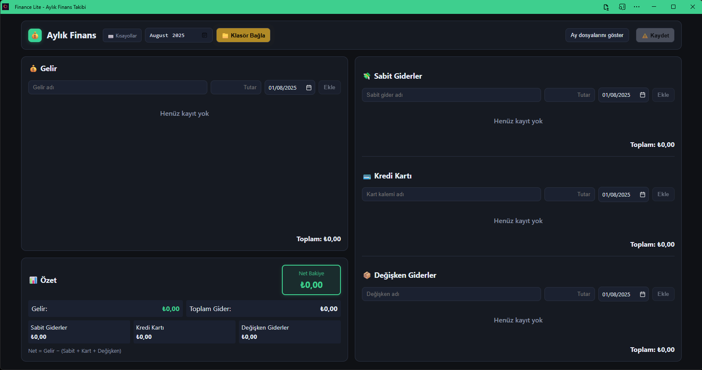

# Finance Lite - Aylık Finans Takip Uygulaması



Finance Lite, aylık gelir ve giderlerinizi kolayca takip etmenizi sağlayan modern bir PWA (Progressive Web App) uygulamasıdır. React ve TypeScript ile geliştirilmiş olup, File System Access API sayesinde verilerinizi doğrudan bilgisayarınızda seçtiğiniz klasöre kaydedebilir.

> **Önemli Not:** Bu uygulama kişisel kullanım için geliştirilmiştir. Diğer kişiler de isterlerse kullanabilir, ancak herhangi bir geliştirme veya destek süreci desteklenmemektedir.

## ✨ Özellikler

### 💰 Finans Yönetimi
- 💰 Gelir takibi
- 💸 Sabit gider takibi
- 💳 Kredi kartı harcamaları takibi  
- 📦 Değişken gider takibi
- 📊 Aylık özet ve net bakiye hesaplama
- 📅 Ay bazlı veri yönetimi
- 🔄 Kayıtları düzenleme ve silme
- 📱 Mobil uyumlu responsive tasarım

### 🗂️ Dosya Yönetimi
- 📁 **File System Access API**: Verilerinizi bilgisayarınızda istediğiniz klasöre kaydedin
- 💾 **Otomatik Kaydetme**: Her ay için ayrı JSON dosyası (örn: `2025-01.json`)
- 📂 **Klasör Dosyalarını Görüntüleme**: Seçili klasördeki tüm ay dosyalarını listeleyin
- ⬇️ **Kolay İçe Aktarma**: Mevcut ay dosyalarını tek tıkla içe aktarın
- 🔄 **Gerçek Zamanlı Senkronizasyon**: Ay değiştirdiğinizde ilgili dosya otomatik yüklenir

### 🚀 PWA Özellikleri
- ⬇️ **Yüklenebilir**: Masaüstünde uygulama gibi çalışır
- 🌐 **Offline Çalışma**: İnternet bağlantısı olmadan da kullanabilirsiniz
- 🔄 **Otomatik Güncelleme**: Yeni sürümler otomatik olarak güncellenir
- 📱 **Mobil Uyumlu**: Telefon ve tablet desteği

### ⌨️ Klavye Kısayolları
- `Ctrl+S`: Hızlı kaydetme
- `Ctrl+H`: Header'a odaklanma
- `Escape`: Dialog kapatma

### 🎨 Kullanıcı Deneyimi
- 🎭 **Dinamik Arayüz**: Hover efektleri ve pulse animasyonları
- 🔔 **Bildirimler**: İşlem durumları için görsel geri bildirim
- ⚠️ **Onay Dialogları**: Önemli işlemler için güvenlik
- 📋 **Scroll Yönetimi**: Uzun listelerde otomatik scroll
- 🎯 **Erişilebilirlik**: Screen reader desteği ve ARIA etiketleri

## 🚀 Kurulum

### Gereksinimler

- Node.js (v16 veya üzeri)
- npm veya yarn
- **Chrome, Edge veya Chromium tabanlı tarayıcı** (File System Access API için)

### Adımlar

1. Repoyu klonlayın:

```bash
git clone https://github.com/kullaniciadi/finance-lite.git
cd finance-lite
```

2. Bağımlılıkları yükleyin:

```bash
npm install
# veya
yarn install
```

3. Geliştirme sunucusunu başlatın:

```bash
npm run dev
# veya
yarn dev
```

4. Tarayıcınızda [http://localhost:5173](http://localhost:5173) adresini açın.

## 📱 PWA Yükleme

Uygulama PWA (Progressive Web App) olarak tasarlanmıştır:

1. Desteklenen tarayıcılarda (Chrome, Edge) adres çubuğunda "Yükle" ikonu görünür
2. Bu ikona tıklayarak uygulamayı masaüstünüze yükleyebilirsiniz
3. Yüklendikten sonra offline olarak da çalışır
4. Otomatik güncelleme desteği vardır

## 📁 Veri Yönetimi

### File System Access API (Önerilen)

Uygulama, modern **File System Access API** kullanarak verilerinizi doğrudan bilgisayarınızda istediğiniz klasöre kaydeder:

1. **📁 Klasör Bağla** butonuna tıklayın
2. İstediğiniz klasörü seçin ve yazma izni verin
3. Verileriniz otomatik olarak o klasöre kaydedilir
4. Her ay için ayrı JSON dosyası oluşturulur (örn: `2025-01.json`, `2025-02.json`)

### Dosya Formatı

JSON dosyaları aşağıdaki formatta saklanır:

```json
{
  "month": "2025-01",
  "entries": [
    {
      "id": "unique-uuid",
      "type": "income|fixed|card|variable",
      "title": "Maaş",
      "amount": 15000,
      "date": "2025-01-01",
      "createdAt": 1735689600000
    }
  ]
}
```

### Tarayıcı Desteği

- ✅ **Chrome/Chromium**: Tam destek
- ✅ **Microsoft Edge**: Tam destek  
- ❌ **Firefox**: Desteklenmiyor (localStorage fallback)
- ❌ **Safari**: Desteklenmiyor (localStorage fallback)

> **Not**: File System Access API desteklenmeyen tarayıcılarda uygulama otomatik olarak localStorage kullanır.

## 🔧 Dağıtım

Uygulamayı derlemek için:

```bash
npm run build
# veya
yarn build
```

Derlenen dosyalar `dist/` klasöründe oluşturulacaktır. Bu dosyaları herhangi bir statik web sunucusunda barındırabilirsiniz.

### PWA Dağıtımı

- Uygulama otomatik olarak PWA olarak derlenir
- Service Worker dosyaları otomatik oluşturulur
- HTTPS üzerinden servis edilmelidir (PWA gereksinimi)
- Manifest dosyası otomatik olarak eklenir

## 🛠️ Teknolojiler

### Ana Teknolojiler
- [React](https://reactjs.org/) v19.1.1 - UI kütüphanesi
- [TypeScript](https://www.typescriptlang.org/) v5.8.3 - Tip güvenliği
- [Vite](https://vitejs.dev/) v7.1.2 - Geliştirme ortamı ve derleme aracı

### PWA ve Dosya İşlemleri
- [vite-plugin-pwa](https://vite-pwa-org.netlify.app/) v1.0.3 - PWA desteği
- [File System Access API](https://developer.mozilla.org/en-US/docs/Web/API/File_System_Access_API) - Dosya sistemi erişimi
- [Workbox](https://developers.google.com/web/tools/workbox) - Service Worker yönetimi

### Diğer Özellikler
- CSS3 - Modern styling ve animasyonlar
- Web Storage API - localStorage fallback
- Notification API - Toast bildirimleri
- ARIA - Erişilebilirlik desteği

## Lisans

MIT
